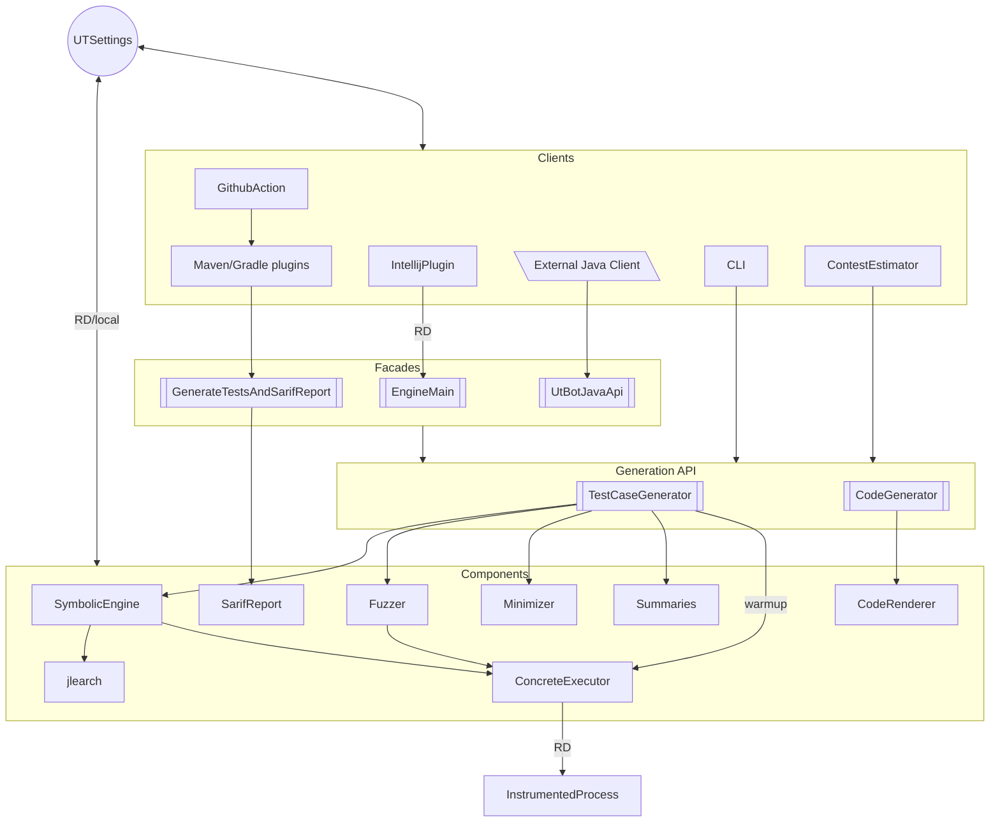
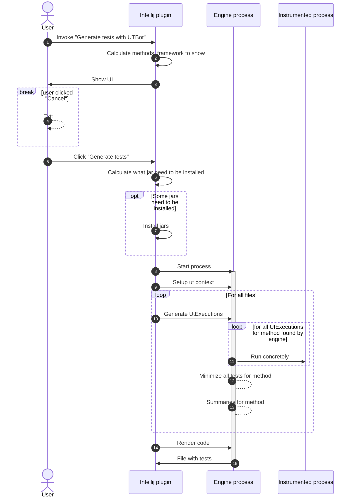

# Overall Unit Test Bot Architecture

Unit Test Bot overall architecture can be presented as following bird-eye view. Look below to check each component's purpose.



## Typical interraction between components 

Interaction diagram started from Intellij plugin UI is presented below


# Clients

### Intellij plugin
> Module: [utbot-intellij](https://github.com/UnitTestBot/UTBotJava/tree/main/utbot-intellij)
>
> Purpose: UI interface for Java/Kotlin users


TODO (Vassily Kudryashov)

### Maven/gradle plugin

TODO (Nikita Stroganov)

### Github action

TODO (Nikita Stroganov)

### CLI

TODO (Nikita Stroganov)

### Contest estimator
Contest estimator runs UnitTestBot on the provided projects and returns the generation statistics such as instruction coverage.

Contest estimator is placed in the [utbot-junit-contest][contest estimator 1] module and has two entry points:
- [ContestEstimator.kt][contest estimator 2] is the main entry point. It runs UnitTestBot on the specified projects, calculates statistics for the target classes and projects, and outputs them to a console.
- [StatisticsMonitoring.kt][contest estimator 3] is an additional entry point, which does the same as the previous one but can be configured from a file and dumps the resulting statistics to a file.
It is used to [monitor and chart][contest estimator 4] statistics nightly.

[contest estimator 1]: ../utbot-junit-contest
[contest estimator 2]: ../utbot-junit-contest/src/main/kotlin/org/utbot/contest/ContestEstimator.kt
[contest estimator 3]: ../utbot-junit-contest/src/main/kotlin/org/utbot/monitoring/StatisticsMonitoring.kt
[contest estimator 4]: NightStatisticsMonitoring.md

# Components

### Symbolic engine
TODO (Alexey Menshutin)

### Concrete executor
TODO (Sergey Pospelov)

### Instrumented process
TODO (Rustam Sadykov)

### Code renderer
TODO (Egor Kulikov)

### Fuzzer
TODO (Maxim Pelevin)

### Minimizer
TODO (Sergey Pospelov)

### Summaries
The summarization process includes the generation of the following meta-information:
- method names for tests
- display names for tests
- JavaDocs for tests
- simple comments for group of tests (regions)

Each of these stages can be turned off by changing 
the settings located in ```org.utbot.summary.UtSummarySettings```.

If the summarization process for some reason was failed at one of the stages due to an error or insufficient information, 
then the test method receives a unique name and no more meta-information.

The approach to generating meta-information depends on the type of UtExection for which the meta-information is being created and can vary significantly.
Also, JavaDocs built in two modes: as plain text or in especial format enriched with the custom java tags.

This subsystem is fully located in the ```utbot-summary``` module.

### Sarif report
TODO (Nikita Stroganov)


# Cross-cutting subsystems

### Logging
TODO (Arteniy Kononov)

### RD
TODO (Arteniy Kononov)

### UTSettings
TODO (Vassily Kudryashov)

