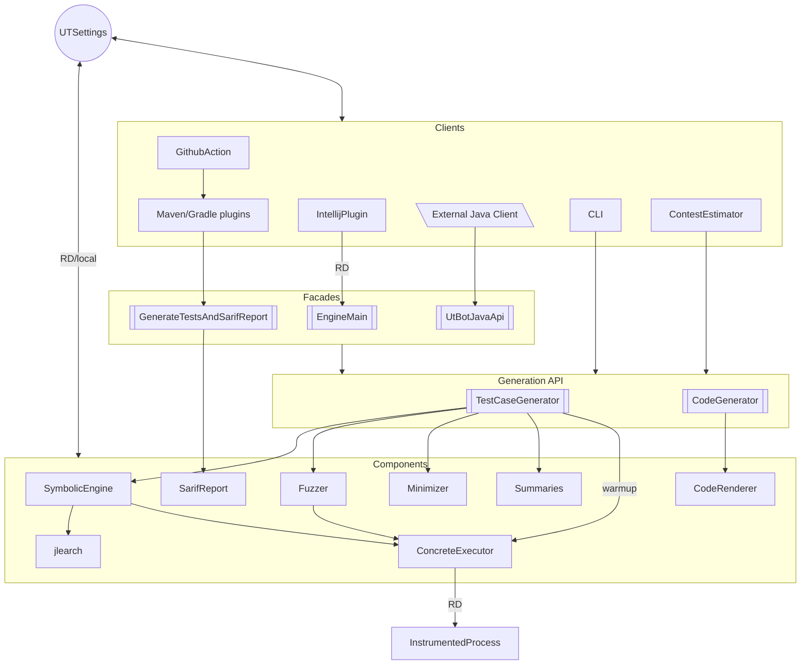
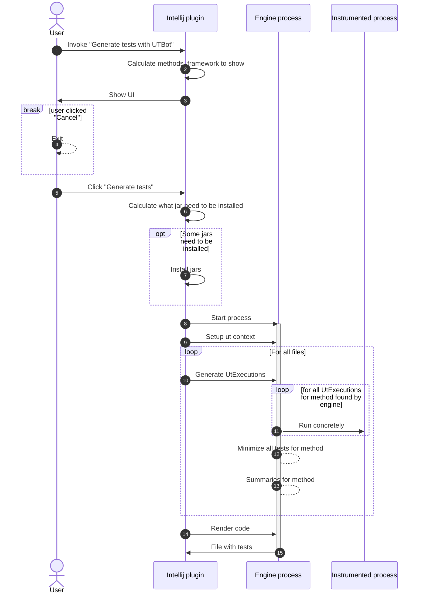

# Overall Unit Test Bot Architecture

Unit Test Bot overall architecture can be presented as following bird-eye view. Look below to check each component's purpose.



## Typical interraction between components 

Interaction diagram started from Intellij plugin UI is presented below


# Clients

### Intellij plugin
> Module: [utbot-intellij](https://github.com/UnitTestBot/UTBotJava/tree/main/utbot-intellij)
>
> Purpose: UI interface for Java/Kotlin users


TODO (Vassily Kudryashov)

### Gradle/Maven plugin

> Modules:
> [utbot-gradle](https://github.com/UnitTestBot/UTBotJava/tree/main/utbot-gradle),
> [utbot-maven](https://github.com/UnitTestBot/UTBotJava/tree/main/utbot-maven)
> 
> Purpose: Plugins for Gradle/Maven build systems

Plugins just provide user settings (such as test generation timeout, testing framework and so on) 
to the `GenerateTestsAndSarifReportFacade` which runs test generation and creates SARIF reports.

More information about both plugins can be found in the following design documents:
- [utbot-gradle.md](https://github.com/UnitTestBot/UTBotJava/blob/main/utbot-gradle/docs/utbot-gradle.md)
- [utbot-maven.md](https://github.com/UnitTestBot/UTBotJava/blob/main/utbot-maven/docs/utbot-maven.md)

### GitHub action

> Repository: [UTBotJava-action](https://github.com/UnitTestBot/UTBotJava-action)
> 
> Purpose: Display detected errors in the GitHub section "Security Code Scanning Alerts"

UTBotJava-action uses our [gradle plugin](https://github.com/UnitTestBot/UTBotJava/tree/main/utbot-gradle) 
to run UnitTestBot on the User's repository and then imports the SARIF output into the Security Code Scanning Alerts section,
where the User can find all the displayed code errors.

Please note that at the moment this action cannot work with Maven projects due to the fact that
our [maven plugin](https://github.com/UnitTestBot/UTBotJava/tree/main/utbot-maven) is not published.

More information about the action can be found [here](https://github.com/UnitTestBot/UTBotJava-action#readme).

Also, there is a detailed [example](https://github.com/UnitTestBot/UTBotJava-action-example) of using UTBotJava-action.

### CLI

TODO (???)

### Contest estimator
Contest estimator runs UnitTestBot on the provided projects and returns the generation statistics such as instruction coverage.

Contest estimator is placed in the [utbot-junit-contest][contest estimator 1] module and has two entry points:
- [ContestEstimator.kt][contest estimator 2] is the main entry point. It runs UnitTestBot on the specified projects, calculates statistics for the target classes and projects, and outputs them to a console.
- [StatisticsMonitoring.kt][contest estimator 3] is an additional entry point, which does the same as the previous one but can be configured from a file and dumps the resulting statistics to a file.
It is used to [monitor and chart][contest estimator 4] statistics nightly.

[contest estimator 1]: ../utbot-junit-contest
[contest estimator 2]: ../utbot-junit-contest/src/main/kotlin/org/utbot/contest/ContestEstimator.kt
[contest estimator 3]: ../utbot-junit-contest/src/main/kotlin/org/utbot/monitoring/StatisticsMonitoring.kt
[contest estimator 4]: NightStatisticsMonitoring.md

# Components

### Symbolic engine
TODO (Alexey Menshutin)

### Concrete executor
`ConcreteExecutor` is the input point for the instrumented process which is used by our symbolic and fuzzing engines. The main purpose of this class is to provide smooth and concise interaction between the instrumented process and users whereas the instrumented process executes a given function with supplied arguments.

`ConcreteExecutor` is parametrized by specific `Instrumentation` and its return type via generic arguments. `Instrumentation` is an interface, so inheritors have to implement the logic of invocation of a specific method in isolated environment as well as the `transform` function which is used for instrumenting classes. For our purposes we use `UtExecutionInstrumentation`.

The main function of `ConcreteExecutor` is 
```kotlin 
suspend fun executeAsync(
    kCallable: KCallable<*>,
    arguments: Array<Any?>,
    parameters: Any?
): TResult
```
which serializes the arguments and some parameters (such as statics, etc.), sends it to the instrumented process and retrieves the result.

Internally `ConcreteExecutor` uses `RD` for interprocess communication and `Kryo` for objects serialization. You don't need to provide a marshaller, as `Kryo` serializes objects by itself (but sometimes it fails).

`ConcreteExecutor` is placed in the [utbot-instrumentation](../utbot-instrumentation) module and tests are placed in the [utbot-instrumentation-tests](../utbot-instrumentation-tests) module.

### Instrumented process
TODO (Rustam Sadykov)

### Code renderer
TODO (Egor Kulikov)

### Fuzzer
TODO (Maxim Pelevin)

### Minimizer
Minimization is used to decrease the amount of `UtExecution`s without coverage degradation. 

The entry point is the [minimizeTestCase](https://github.com/UnitTestBot/UTBotJava/blob/d2d2e350bc75943b78f2078002a5cabc5dd62072/utbot-framework/src/main/kotlin/org/utbot/framework/minimization/Minimization.kt#L38) function. It receives a set of `UtExecution`s and a groupping function (it groups by `UtExecution::utExecutionResult`), then the minimization divides `UtExecution`s into several groups and each group is minimized independently.

We have different groups, here are some of them:
- A successfull regression suite which consists of `UtSuccess` and `UtExplicitlyThrownException` executions.
- An error suite which consists of `UtImplicitlyThrownException` executions.
- A timeout suite which consists of `UtTimeoutException` executions.
- A crash suite which consists of executions where some parts of the engine failed.
- etc.

Each provided `UtExecution` should have a coverage information, otherwise we add this execution to the test suite instantly. A coverage data is usually obtained from the instrumented process and consists of covered lines.

To minimize executions inside a group we use a simple greedy algorithm:
1. Pick an execution which provides the most yet uncovered lines.
2. Add this execution to the final suite and mark new lines as covered
3. Repeat from the first step till there are executions which contain uncovered lines.

The whole minimization code located in the [org.utbopt.framework.minimization](utbot-framework/src/main/kotlin/org/utbot/framework/minimization) package inside the [utbot-framework](../utbot-framework) module.

### Summaries
The summarization process includes the generation of the following meta-information:
- method names for tests
- display names for tests
- JavaDocs for tests
- simple comments for group of tests (regions)

Each of these stages can be turned off by changing 
the settings located in ```org.utbot.summary.UtSummarySettings```.

If the summarization process for some reason was failed at one of the stages due to an error or insufficient information, 
then the test method receives a unique name and no more meta-information.

The approach to generating meta-information depends on the type of UtExection for which the meta-information is being created and can vary significantly.
Also, JavaDocs built in two modes: as plain text or in especial format enriched with the custom java tags.

This subsystem is fully located in the ```utbot-summary``` module.

### SARIF report

SARIF (Static Analysis Results Interchange Format) is a JSON–based format for displaying static analysis results. 

All the necessary information about the format and its use can be found
in the [official documentation](https://github.com/microsoft/sarif-tutorials/blob/main/README.md)
and in the [GitHub wiki](https://docs.github.com/en/code-security/code-scanning/integrating-with-code-scanning/sarif-support-for-code-scanning) about it.

In our project `SarifReport` class is responsible for generating reports.
We use SARIF reports to display errors detected by UnitTestBot such as
unchecked exceptions, overflows, assertion errors and so on.

For example, for the class below
```Java
public class Main {
    int example(int x) {
        return 1 / x;
    }
}
```

We'll create a report which contains the following information:
- `java.lang.ArithmeticException: / by zero` may occur in the line 3
- The exception occurs if `x == 0`
- To reproduce this error, the user can run the generated test `MainTest.testExampleThrowsAEWithCornerCase`
- The exception stacktrace: 
  - Main.example(Main.java:3)
  - MainTest.testExampleThrowsAEWithCornerCase(MainTest.java:39)

# Cross-cutting subsystems

### Logging
TODO (Arteniy Kononov)

### RD
TODO (Arteniy Kononov)

### UTSettings
TODO (Vassily Kudryashov)

