# UnitTestBot overall architecture

Get the bird's-eye view of UnitTestBot overall architecture in the following chart. Check the purpose of each component in the descriptions below.

```mermaid
flowchart TB
    subgraph Clients
        direction LR
        IntellijPlugin        
        MavenPlugin["Maven/Gradle plugins"]
        GithubAction-->MavenPlugin
        ExternalJavaClient[\External Java Client\]
        CLI
        ContestEstimator    
                     
    end    

    subgraph Facades
        direction LR
        EngineMain[[EngineMain]]
        UtBotJavaApi[[UtBotJavaApi]]
        GenerateTestsAndSarifReport[[GenerateTestsAndSarifReport]]       
    end
    IntellijPlugin--Rd-->EngineMain
    MavenPlugin-->GenerateTestsAndSarifReport
    ExternalJavaClient-->UtBotJavaApi

    subgraph API["Generation API"]
        direction LR
        TestCaseGenerator[[TestCaseGenerator]]
        CodeGenerator[[CodeGenerator]]
    end
    Facades-->API
    CLI-->API
    ContestEstimator-->API
    
        

    subgraph Components
        direction LR
        SymbolicEngine-->jlearch
        SymbolicEngine-->ConcreteExecutor
        Fuzzer-->ConcreteExecutor
        SarifReport
        Minimizer
        CodeRenderer
        Summaries
        jlearch
    end    
    CodeGenerator-->CodeRenderer
    TestCaseGenerator-->SymbolicEngine
    TestCaseGenerator-->Fuzzer
    TestCaseGenerator-->Minimizer
    TestCaseGenerator-->Summaries
    GenerateTestsAndSarifReport-->SarifReport

    UTSettings((UTSettings))
    UTSettings<--Rd/local-->Components    
    UTSettings<---->Clients
    TestCaseGenerator--warmup-->ConcreteExecutor
    ConcreteExecutor--Rd-->InstrumentedProcess

```



## Typical interaction between components

An interaction diagram for UnitTesBot components is presented below. See how it starts from IntelliJ IDEA plugin UI and follow the flow.


## Clients

### IntelliJ IDEA plugin

The plugin provides
* a UI for the IntelliJ-based IDEs to use UnitTestBot directly from source code,
* the linkage between IntelliJ Platform API and UnitTestBot API,
* support for the most popular programming languages and frameworks for end users (the plugin and its optional dependencies are described in [plugin.xml](https://github.com/UnitTestBot/UTBotJava/blob/main/utbot-intellij/src/main/resources/META-INF/plugin.xml) and nearby, in the [`META-INF`](https://github.com/UnitTestBot/UTBotJava/tree/main/utbot-intellij/src/main/resources/META-INF) folder.

The main plugin module is [utbot-intellij](https://github.com/UnitTestBot/UTBotJava/tree/main/utbot-intellij), providing support for Java and Kotlin.  
Also, there is an auxiliary [utbot-ui-commons](https://github.com/UnitTestBot/UTBotJava/tree/main/utbot-ui-commons) module to support providers for other languages.

As for the UI, there are two entry points:
* [GenerateTestAction](https://github.com/UnitTestBot/UTBotJava/blob/main/utbot-intellij/src/main/kotlin/org/utbot/intellij/plugin/ui/actions/GenerateTestsAction.kt) for _preparing and calling_ test generation;
* [SettingsWindow](https://github.com/UnitTestBot/UTBotJava/blob/main/utbot-intellij/src/main/kotlin/org/utbot/intellij/plugin/settings/SettingsWindow.kt) for _per-project_ UnitTestBot configuring.

The main plugin-specific features are:
* A common action for generating tests right from the editor or a project tree — with a generation scope from a single method up to the whole source root. See [GenerateTestAction](https://github.com/UnitTestBot/UTBotJava/blob/main/utbot-intellij/src/main/kotlin/org/utbot/intellij/plugin/ui/actions/GenerateTestsAction.kt) — the same for all supported languages.
* Auto-installation of the user-chosen testing framework as a project library dependency (JUnit 4, JUnit 5, and TestNG are supported). See [UtIdeaProjectModelModifier](https://github.com/UnitTestBot/UTBotJava/blob/main/utbot-intellij/src/main/kotlin/org/utbot/intellij/plugin/util/UtIdeaProjectModelModifier.kt) and the Maven-specific version: [UtMavenProjectModelModifier](https://github.com/UnitTestBot/UTBotJava/blob/main/utbot-intellij/src/main/kotlin/org/utbot/intellij/plugin/util/UtMavenProjectModelModifier.kt).
* Suggesting the location for a test source root and auto-generating the `utbot_tests` folder there, providing users with a sandbox in their codespace.
* Optimizing generated code with IDE-provided intentions (experimental). See [IntentionHelper](https://github.com/UnitTestBot/UTBotJava/blob/main/utbot-intellij/src/main/kotlin/org/utbot/intellij/plugin/generator/IntentionHelper.kt) for details.
* An option for distributing generation time between symbolic execution and fuzzing explicitly.
* Running generated tests while showing coverage with the IDE-provided measurement tools. See [RunConfigurationHelper](https://github.com/UnitTestBot/UTBotJava/blob/main/utbot-intellij/src/main/kotlin/org/utbot/intellij/plugin/util/RunConfigurationHelper.kt) for implementation.
* Displaying the UnitTestBot-found code defects as IntelliJ-specific inspections and quickfixes in the "Problems" tool window. See the [inspection](https://github.com/UnitTestBot/UTBotJava/tree/main/utbot-intellij/src/main/kotlin/org/utbot/intellij/plugin/inspection) package.
* Two kinds of Javadoc comments in the generated code: rendered as plain text and structured via custom tags. See the [javadoc](https://github.com/UnitTestBot/UTBotJava/tree/main/utbot-intellij/src/main/kotlin/org/utbot/intellij/plugin/javadoc) package.
* A self-documenting [`settings.properties`](https://github.com/UnitTestBot/UTBotJava/blob/main/docs/SettingsProperties.md) file with the settings for low-level UnitTestBot tuning.

### Gradle/Maven plugins

Plugins for Gradle/Maven build systems provide the UnitTestBot `GenerateTestsAndSarifReportFacade` component with the user-chosen settings (test generation timeout, testing framework, etc.). This component runs test generation and creates SARIF reports.

For more information on the plugins, please refer to the detailed design documents:
- [UnitTestBot Gradle plugin](https://github.com/UnitTestBot/UTBotJava/blob/main/utbot-gradle/docs/utbot-gradle.md)
- [UnitTestBot Maven plugin](https://github.com/UnitTestBot/UTBotJava/blob/main/utbot-maven/docs/utbot-maven.md)

You can find the modules here:
* [utbot-gradle](https://github.com/UnitTestBot/UTBotJava/tree/main/utbot-gradle)
* [utbot-maven](https://github.com/UnitTestBot/UTBotJava/tree/main/utbot-maven)

### GitHub Action

UnitTestBot GitHub Action displays the detected code defects in the GitHub "Security Code Scanning Alerts" section.

You can find UnitTestBot GitHub Action in the separate [repository](https://github.com/UnitTestBot/UTBotJava-action).

UnitTestBot GitHub Action uses the [UnitTestBot Gradle plugin](https://github.com/UnitTestBot/UTBotJava/tree/main/utbot-gradle)
to run UnitTestBot on the user's repository and imports the SARIF output into the "Security Code Scanning Alerts" section.
Please note that at the moment this action cannot work with Maven projects because
the [UnitTestBot Maven plugin](https://github.com/UnitTestBot/UTBotJava/tree/main/utbot-maven) has not been published yet.

For more information on UnitTestBot GitHub Action, please refer to the [related docs](https://github.com/UnitTestBot/UTBotJava-action#readme).
You can also find a detailed [usage example](https://github.com/UnitTestBot/UTBotJava-action-example).

### Command-line interface (CLI)

With CLI, one can run UnitTestBot from the command line.

CLI implementation is placed in the [utbot-cli](https://github.com/UnitTestBot/UTBotJava/tree/main/utbot-cli) module. UnitTestBot CLI has two main commands: `generate` and `run` — use `--help` to find more info on their options.

An executable CLI is distributed as a JAR file.

We provide Linux Docker images containing CLI. They are stored on [GitHub Packages](https://github.com/UnitTestBot/UTBotJava/pkgs/container/utbotjava%2Futbot_java_cli).

### Contest estimator

Contest estimator runs UnitTestBot on the provided projects and returns the generation statistics such as instruction coverage.

Contest estimator is placed in the [utbot-junit-contest](https://github.com/UnitTestBot/UTBotJava/tree/main/utbot-junit-contest) module and has two entry points:
- [ContestEstimator.kt](https://github.com/UnitTestBot/UTBotJava/blob/main/utbot-junit-contest/src/main/kotlin/org/utbot/contest/ContestEstimator.kt) is the main entry point. It runs UnitTestBot on the specified projects, calculates statistics for the target classes and projects, and outputs them to a console.
- [StatisticsMonitoring.kt](https://github.com/UnitTestBot/UTBotJava/blob/main/utbot-junit-contest/src/main/kotlin/org/utbot/monitoring/StatisticsMonitoring.kt) is an additional entry point, which does the same as the previous one but can be configured from a file and dumps the resulting statistics to a file.
  It is used to [monitor and chart](https://github.com/UnitTestBot/UTBotJava/blob/main/docs/NightStatisticsMonitoring.md) statistics nightly.

## Components

### Symbolic engine

Symbolic engine is a component maintaining the whole analysis process: from the moment it takes information about a method under test (MUT) till the moment it returns a set of execution results along with the information required to reproduce the MUT's execution paths. The engine uses symbolic execution to explore the paths in a MUT's control flow graph (CFG).

The technique is rather complex, so the engine consists of several subcomponents, each responsible for a certain part of the analysis:

* [UtBotSymbolicEngine.kt](https://github.com/UnitTestBot/UTBotJava/blob/main/utbot-framework/src/main/kotlin/org/utbot/engine/UtBotSymbolicEngine.kt) contains a `UtBotSymbolicEngine` class — it manages interaction between different parts of the system and controls the analysis flow. This class is an entry point for symbolic execution in UnitTestBot. Using `UtBotSymbolicEngine` API, the users or UnitTestBot components can start, suspend or stop the analysis. `UtBotSymbolicEngine` provides a connection between the components by taking execution states from [PathSelector](https://github.com/UnitTestBot/UTBotJava/blob/main/utbot-framework/src/main/kotlin/org/utbot/engine/selectors/PathSelector.kt) and pushing them either into [Traverser](https://github.com/UnitTestBot/UTBotJava/blob/main/utbot-framework/src/main/kotlin/org/utbot/engine/Traverser.kt) or in [ConcreteExecutor](https://github.com/UnitTestBot/UTBotJava/blob/main/utbot-instrumentation/src/main/kotlin/org/utbot/instrumentation/ConcreteExecutor.kt), depending on their status and settings.
  In a few words, the pipeline looks like this: the engine takes a state from [PathSelector](https://github.com/UnitTestBot/UTBotJava/blob/main/utbot-framework/src/main/kotlin/org/utbot/engine/selectors/PathSelector.kt), pushes it into [Traverser](https://github.com/UnitTestBot/UTBotJava/blob/main/utbot-framework/src/main/kotlin/org/utbot/engine/Traverser.kt), and then gets an updated state from it. If this state is not terminal, `UtBotSymbolicEngine` pushes it to the queue in the path selector. If this state is terminal, it either calls `ConcreteExecutor` to get a concrete result state or yields a symbolic result into the resulting flow.
* [PathSelector](https://github.com/UnitTestBot/UTBotJava/blob/main/utbot-framework/src/main/kotlin/org/utbot/engine/selectors/PathSelector.kt) is a class making a decision on which instruction of the program should be processed next. It is located in `PathSelector.kt`, but the whole [selectors](https://github.com/UnitTestBot/UTBotJava/tree/main/utbot-framework/src/main/kotlin/org/utbot/engine/selectors) package is related to it. `PathSelector` has a pretty simple interface: it can put a state in the queue or return a state from that queue.
* [Traverser](https://github.com/UnitTestBot/UTBotJava/blob/main/utbot-framework/src/main/kotlin/org/utbot/engine/Traverser.kt) processes a given state. It contains information about CFG, a hierarchy of classes in the program, a symbolic type system, and mocking information. `Traverser` is the most important class in the symbolic engine module. It knows how to process instructions in CFG, how to update the dependent symbolic memory, and which constraints should be added to go through a certain path. Having processed an instruction from the given state, `Traverser` creates a new one, with updated memory and path constraints.

There are other important classes in the symbolic engine subsystem. Here are some of them:
* [Memory](https://github.com/UnitTestBot/UTBotJava/blob/main/utbot-framework/src/main/kotlin/org/utbot/engine/Memory.kt) is responsible for the symbolic memory representation of a state in the program.
* [TypeRegistry](https://github.com/UnitTestBot/UTBotJava/blob/main/utbot-framework/src/main/kotlin/org/utbot/engine/types/TypeRegistry.kt) contains information about a type system.
* `Mocker` decides whether we should mock an object or not.

You can find all the engine-related classes in the [engine](https://github.com/UnitTestBot/UTBotJava/tree/main/utbot-framework/src/main/kotlin/org/utbot/engine) module.

### Concrete executor

`ConcreteExecutor` is the input point for the _instrumented process_ used by UnitTestBot symbolic engine and fuzzer. This class provides a smooth and concise interaction between the _instrumented process_ and a user, whereas the _instrumented process_ executes a given function with the supplied arguments.

`ConcreteExecutor` is parameterized with `Instrumentation` and its return type via the generic arguments. `Instrumentation` is an interface, so inheritors have to implement the logic of a specific method invocation in an isolated environment as well as the `transform` function used for instrumenting classes. For our purposes, we use `UtExecutionInstrumentation`.

The main `ConcreteExecutor` function is
```kotlin 
suspend fun executeAsync(
    kCallable: KCallable<*>,
    arguments: Array<Any?>,
    parameters: Any?
): TResult
```
It serializes the arguments and some parameters (e.g., static fields), sends it to the _instrumented process_ and retrieves the result.

Internally, `ConcreteExecutor` uses `Rd` for interprocess communication and `Kryo` for objects serialization. You don't need to provide a marshaller, as `Kryo` serializes the objects (sometimes it fails).

`ConcreteExecutor` is placed in the [utbot-instrumentation](../utbot-instrumentation) module. You can find the corresponding tests in the [utbot-instrumentation-tests](../utbot-instrumentation-tests) module.

### Instrumented process

`Instrumented process` concretely runs the user functions with the specified arguments and returns the result of execution.

Additionally, `Instrumented process` evaluates instruction coverage and mocks function invocations and creating instances via the user's Java bytecode instrumentation.

The main concept is _instrumentation_. `Instrumentation` is a class that implements the [corresponding](https://github.com/UnitTestBot/UTBotJava/blob/main/utbot-instrumentation/src/main/kotlin/org/utbot/instrumentation/instrumentation/Instrumentation.kt) interface. It transforms the user code and provides invoking user functions.

`Instrumented process` supports the following commands described in [InstrumentedProcessModel.kt](https://github.com/UnitTestBot/UTBotJava/blob/main/utbot-rd/src/main/rdgen/org/utbot/rd/models/InstrumentedProcessModel.kt):
- `AddPaths` tells where the `Instrumented process` should search for the user classes.
- `Warmup` forces loading and instrumenting user classes.
- `SetInstrumentation` tells which instrumentation the `Instrumented process` should use.
- `InvokeMethodCommand` requests the `Instumented process` to invoke a given user function and awaits the results.
- `StopProcess` just stops the `Instrumented process`.
- `CollectCoverage` requests collecting code coverage for the specified class.
- `ComputeStaticField` requests the specified static field value.

These commands are delivered from the other processes by `Rd`.

The main instrumentation of UnitTestBot is [UtExecutionInstrumentation](https://github.com/UnitTestBot/UTBotJava/blob/main/utbot-framework/src/main/kotlin/org/utbot/framework/concrete/UtExecutionInstrumentation.kt).

### Code generator

Code generation and rendering are a part of the test generation process in UnitTestBot.
UnitTestBot gets the synthetic representation of generated test cases from the fuzzer or the symbolic engine. This representation, or model, is implemented in the `UtExecution` class. The `codegen` module generates the real test code based on this `UtExecution` model and renders it in a human-readable form.

The `codegen` module
- converts `UtExecution` test information into an Abstract Syntax Tree (AST) representation using `CodeGenerator`,
- renders this AST according to the requested configuration (considering programming language, testing
  framework, mocking and parameterization options) using `renderer`.

The `codegen` entry points are:
- `CodeGenerator.generateAsString()`
- `CodeGenerator.generateAsStringWithTestReport()`

The detailed implementation is described in the [Code generation and rendering](https://github.com/UnitTestBot/UTBotJava/blob/main/docs/CodeGenerationAndRendering.md) design doc.

### Fuzzer

Fuzzing is a versatile technique for "guessing" values to be used as method arguments. To generate these kinds of values, the fuzzer uses generators, mutators, and predefined values.

Fuzzing has been previously implemented in UnitTestBot as the solution for Java. For now, we have developed the generic platform that supports generating fuzzing tests for different languages. The Java fuzzing solution in UnitTestBot is marked as deprecated — it will soon be replaced with the fuzzing platform.

You can find the relevant code here:
- `utbot-fuzzing` is the general fuzzing platform module. The related API is located in `org/utbot/fuzzing/Api.kt`.
- `utbot-fuzzer` is the module with the fuzzing solution for Java. Find the corresponding API in `org/utbot/fuzzing/JavaLanguage.kt`.

Entry point for generating values (Java): `org/utbot/fuzzing/JavaLanguage.kt#runJavaFuzzing(...)`

You can find the detailed description in the [Fuzzing Platform](https://github.com/UnitTestBot/UTBotJava/blob/main/docs/Fuzzing%20Platform.md) design doc.

### Minimizer

Minimization is used to decrease the amount of `UtExecution` instances without decreasing coverage.

The entry point is the [minimizeTestCase](https://github.com/UnitTestBot/UTBotJava/blob/d2d2e350bc75943b78f2078002a5cabc5dd62072/utbot-framework/src/main/kotlin/org/utbot/framework/minimization/Minimization.kt#L38) function. It receives a set of `UtExecution` instances and a grouping function (grouping by `UtExecution::utExecutionResult`). Then the minimization procedure divides the set of `UtExecution` instances into several groups. Each group is minimized independently.

We have different groups — here are some of them:
- A _successful regression suite_ that consists of `UtSuccess` and `UtExplicitlyThrownException` executions.
- An _error suite_ consisting of `UtImplicitlyThrownException` executions.
- A _timeout suite_ that consists of `UtTimeoutException` executions.
- A _crash suite_ consisting of executions where some parts of the engine failed.

Each `UtExecution` instance provided should have coverage information, otherwise we add this execution to the test suite instantly. Coverage data are usually obtained from the _instrumented process_ and consist of covered lines.

To minimize the number of executions in a group, we use a simple greedy algorithm:
1. Pick an execution that covers the maximum number of the previously uncovered lines.
2. Add this execution to the final suite and mark new lines as covered.
3. Repeat the first step and continue till there are executions containing uncovered lines.

The whole minimization procedure is located in the [org.utbopt.framework.minimization](utbot-framework/src/main/kotlin/org/utbot/framework/minimization) package inside the [utbot-framework](../utbot-framework) module.

### Summarization module

Summarization is the process of generating detailed test descriptions consisting of
- test method names
- testing framework annotations (including `@DisplayName`)
- Javadoc comments for tests
- cluster comments for groups of tests (_Regions_)

Each of these description elements can be turned off via `{userHome}/.utbot/settings.properties` (which gets information from `UtSettings.kt`).
If the summarization process fails due to an error or insufficient information, then the test method receives a unique name and no additional meta-information.

This meta-information is generated for each type of `UtExecution` model and thus may vary significantly.
Also, Javadoc comments can be rendered in two styles: as plain text or in a special format enriched with the [custom Javadoc tags](https://github.com/UnitTestBot/UTBotJava/blob/main/docs/summaries/CustomJavadocTags.md).

The whole summarization subsystem is located in the `utbot-summary` module.

For detailed information, please refer to the Summarization architecture design document.

### SARIF report generator

SARIF (Static Analysis Results Interchange Format) is a JSON–based format for displaying static analysis results.

All the necessary information about the format and its usage can be found
in the [official documentation](https://github.com/microsoft/sarif-tutorials/blob/main/README.md)
and in the related [GitHub Docs](https://docs.github.com/en/code-security/code-scanning/integrating-with-code-scanning/sarif-support-for-code-scanning).

In UnitTestBot, the `SarifReport` class is responsible for generating SARIF reports.
We use them to display UnitTestBot-detected errors such as unchecked exceptions, overflows, assertion errors, etc.

For example, for the class below
```Java
public class Main {
    int example(int x) {
        return 1 / x;
    }
}
```

UnitTestBot creates a report containing the following information:
- `java.lang.ArithmeticException: / by zero` may occur in line 3
- The exception occurs if `x == 0`
- To reproduce this error, the user can run the generated `MainTest.testExampleThrowsAEWithCornerCase` test
- The exception stack trace:
  - `Main.example(Main.java:3)`
  - `MainTest.testExampleThrowsAEWithCornerCase(MainTest.java:39)`

## Cross-cutting subsystems

### Rd

UnitTestBot consists of three processes (according to the execution order):
* _IDE process_ — the process where the plugin part executes.
* _Engine process_ — the process where the test generation engine executes.
* _Instrumented process_ — the process where concrete execution takes place.

These processes are built on top of the [Reactive distributed communication framework (Rd)](https://github.com/JetBrains/rd) developed by JetBrains.

One of the main Rd concepts is _Lifetime_ — it helps to release shared resources upon the object's termination. You can find the Rd basic ideas and UnitTestBot implementation details in the [Multiprocess architecture](https://github.com/UnitTestBot/UTBotJava/blob/main/docs/RD%20for%20UnitTestBot.md) design doc.

### Settings

In UnitTestBot, _settings_ are the set of _properties_. Each _property_ is a _key=value_ pair and affects some important aspect of UnitTestBot behavior. UnitTestBot as an IntelliJ IDEA plugin, a CI-tool, or a CLI-tool has low-level _core settings_. The UnitTestBot plugin also has per-project _plugin-specific_ settings.

Core settings are persisted in the _settings file_: `{userHome}/.utbot/settings.properties`. This file is designed for reading only. The defaults for the core settings are provided in source code (`UtSettings.kt`).

The plugin-specific settings are stored per project in the _plugin configuration file_: `{projectDir}/.idea/utbot-settings.xml`. Nobody is expected to edit this file manually.

The end user has three places to change UnitTestBot behavior:
1. A `{userHome}/.utbot/settings.properties` file — for global settings.
2. Plugin settings UI (**File** > **Settings** > **Tools** > **UnitTestBot**) — for per-project settings.
3. Controls in the **Generate Tests with UnitTestBot window** dialog — for per-generation settings.

### Logging
TODO