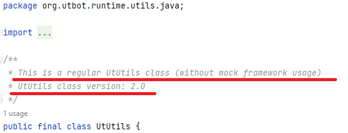

# UtUtils class

## What are the utility methods

_Utility methods_ implement common, often re-used operations which are helpful for accomplishing tasks in many 
classes. In UnitTestBot, _utility methods_ include those related to creating instances, checking deep 
equality, mocking, using lambdas and so on — miscellaneous methods necessary for generated tests.

## Why to create UtUtils class

Previously, UnitTestBot generated _utility methods_ for each test class when they were needed — and only those which 
were necessary for the given class. They were declared right in the generated test class, occupying space. Generating multiple test classes often resulted in duplicating _utility methods_ and consuming even more space.

For now UnitTestBot provides a special `UtUtils` class containing all _utility methods_ if at least one test class needs some of them. This class is generated once and the specific methods are imported from it if necessary. No need for _utility methods_ — no `UtUtils` class is generated.

We create a separate `UtUtils` class for each supported language (if required).

## What does it look like

Here is an example of a documentation comment inherent to every `UtUtils` class:

As one can see, the comment mentions two characteristics of the `UtUtils` class:

1. _Version_

If the generated tests require additional _utility methods_, the
existing `UtUtils` class is upgraded and gets a new version number, which should be defined here:

`org.utbot.framework.codegen.domain.builtin.UtilClassFileMethodProvider.UTIL_CLASS_VERSION`

_2. Mockito support_

UnitTestBot uses [Mockito framework](https://site.mockito.org/) to implement mocking. When generated tests imply mocking, the 
`deepEquals()` 
_utility method_ should be configured — it should have a check: whether the compared object is a mock or not. That is why the `UtUtils` class for the tests with mocking differs from the one without mocking support.

If you have previously generated tests with mocking, the next generated `UtUtils` class supports mocking as well — 
even if 
its version is upgraded or current tests do not need mocking, so that the existing tests can still 
rely on the proper methods from `UtUtils` class.

## Where to find it

`UtUtils` class is usually located in the chosen **Test sources root** near the generated test classes. The corresponding package name mentions the language of the generated tests: e.g. `org.utbot.runtime.utils.java`.

## How to test

If you want to test `UtUtils` class generation using UnitTestBot project itself, refer to the [Manual testing of 
UtUtils class generation #1233](https://github.com/UnitTestBot/UTBotJava/issues/1233).

## How to improve

UnitTestBot does not currently support generating tests for classes from multiple modules simultaneously. If this option was possible, we would probably have to generate a separate `UtUtils` class for each module. Perhaps we could find a special location for a `UtUtils` class reachable from every module.

For now, you can generate separate `UtUtils` classes for different modules only if you manually choose the different **Test sources roots** when generating tests.