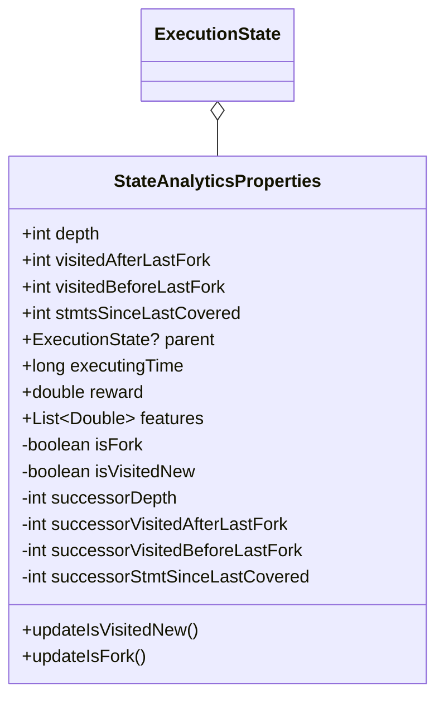

# Changes in Execution State

`StateAnalyticsProperties` maintains properties of `ExecutionState`, which don't need for symbolic execution, but need for `JLearch`.

* `depth: Int` - number of forks on state's path excluded current state, if it is fork. In this case, fork is a state with more than one successors excluded implicit `NPE` branches.
* `visitedAfterLastFork: Int` - number of `stmt`, that was visited by `states` on this state's path after last fork in first time.
* `visitedBeforeLastFork: Int` - number of `stmt`, that was visited by `states` on this state's path before last fork in first time.
* `stmtsSinceLastCovered: Int` - number of `states` on this state's path after last state that visited any `stmt` in first time.
* `parent: ExecutionState?` - parent of current `state`. If `UtSettings.featureProcess == false`, then it is always null, because we don't need this field in this case. If it is not null, then we can't delete `state` until all successors of this state will be deleted, which may cause memory issue.
* `executingTime: Long` - amount of time, during which this state was traversed.
* `reward: Double?` - calculated reward of this state
* `features: List<Double>` - list of extracted features for this state

Field with `successor` prefix is used for constructor of successor properties.

* `updateIsFork()` - set `isFork` on true. This method called when traversing of `stmt` produce more than one explicit state. Now it may be during traversing of `IfStmt`, `SwitchStmt`, `AssignStmt` or `InvokeStmt`.
* `updateIsCoveredNew()` - set `isVisitedNew` on true, set `stmtsSinceLastCovered` on zero and increase `visitedAfterLastFork` on 1. This method is called in `UtBotSymbolicEngine` after new state `s` is polled and `s.stmt` was not visited yet.
