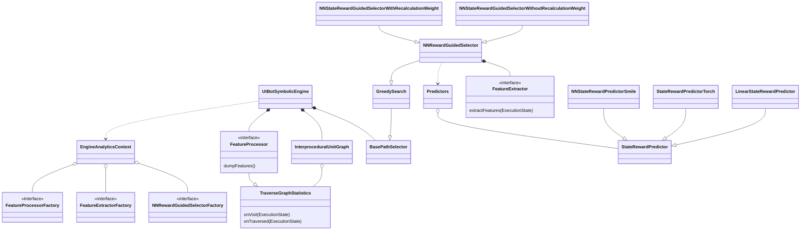
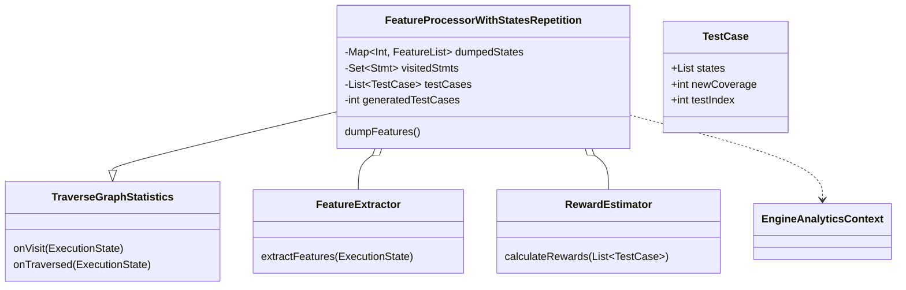

# JLearch architecture

# Global Class Diagram

This diagram doesn't illustrate some details, so read them below.

# FeatureProcessor

It is interface in framework-module, that allows to use implementation from analytics module.

* `dumpFeatures(state: ExecutionState)` - dump features and rewards in some format on disk. Called at the end of traverse in `UtBotSymbolicEngine`

## Implementation class diagram

`State = Pair<Int, Long>`

`FeatureList = List<Double`

## RewardEstimator

Maintains calculation of reward. 

* `calculateRewards(List<TestCase>): Map<Int, Double>` - calculates `coverage` for each state and `time` for each state. `Coverage` - sum of `newCoverage` by `TestCase` that contains its state. `Time` - sum of `state.executingTime` by all states, that has this state on its path. Then calculates `reward(coverage, time)`.

## FeatureProcessorWithStatesRepetition

* `onVisit(state: ExecutionState)` - extractFeatures for state
* `onTraversed(state: ExecutionState)` - create `TestCase`, so we go from `state` to `state.parent` while it is not root, for each `state` on path add its features to `dumpedStates`, calculate coverage of its `TestCase`, increment `generatedTestCases` on 1 and add new `TestCase` in `testCases`.
* `dumpFeatures()` - call `RewardEstimator.calculateRewards()` and write `csv` file for each `TestCase` in format: `newCov,features,reward` for each `state` in it. `newCov` - flag that indicates whether this `TestCase` cover something new or not. So in this approach, each `state` will be written as many times as the number of `TestCase` that has it.
For creating `FeatureExtractor`, it uses `FeatureExtractorFactory` from `EngineAnalyticsContext`.

# FeatureExtractor

It is interface in framework-module, that allows to use implementation from analytics module.
* `extractFeatures(state: ExecutionState)` - create features list for state and store it in `state.features`. Now we extract all features, which were described in [paper](https://files.sri.inf.ethz.ch/website/papers/ccs21-learch.pdf). In feature, we can extend the feature list by other features, for example, NeuroSMT.

# StateRewardPredictor

Interface for reward predictors. Now it has three implementations in `analytics` module:

* `NNStateRewardPredictorSmile`: it uses our own format to store feedforward neural network, and it uses `Smile` library to do multiplication of matrix.
* `NNStateRewardPredictorTorch`: it assumed that a model is any type of model in `pt` format. It uses the `Deep Java library` to use such models.
* `LinearStateRewardPredictor`: it uses our own format to store weights vector: line of doubles, separated by comma with bias as last weight.

It should be created at the beginning of work and stored at `Predictors` class to be used in `NNRewardGuidedSelector` from the `framework` module.

# NNStateRewardGuidedSelector

It uses an `EngineAnalyticsContext` to create `FeatureExtractor`.
We override `ExecutionState.weight` as `NNStateRewardPredictor.predict(this.features)`.
We have two different implementantions:
* `NNStateRewardGuidedSelectorWithRecalculation`: we recalculate reward every time, so in `ExecutionState.weight` we extract features and call predict.
* `NNStateRewardGuidedSlectorWithoutRecalculation`: we extract features in `offerImpl`, calculate `reward` and store it in `ExecutionState.reward` without recalculation it every time.

# EngineAnalyticsContext

It is an object that should be filled by factories in the beginning of work to allow objects from the `framework` module using objects from `analytics` module. 
