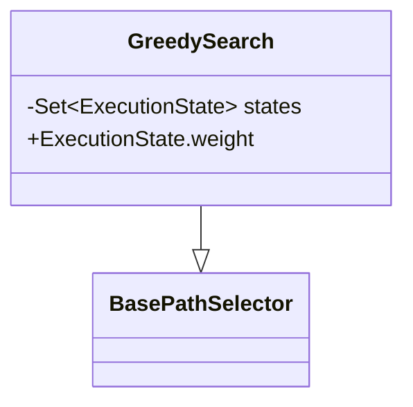
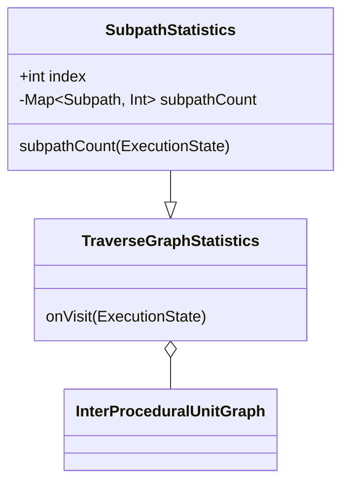
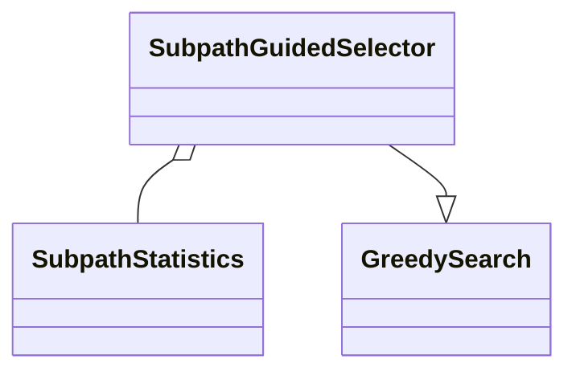
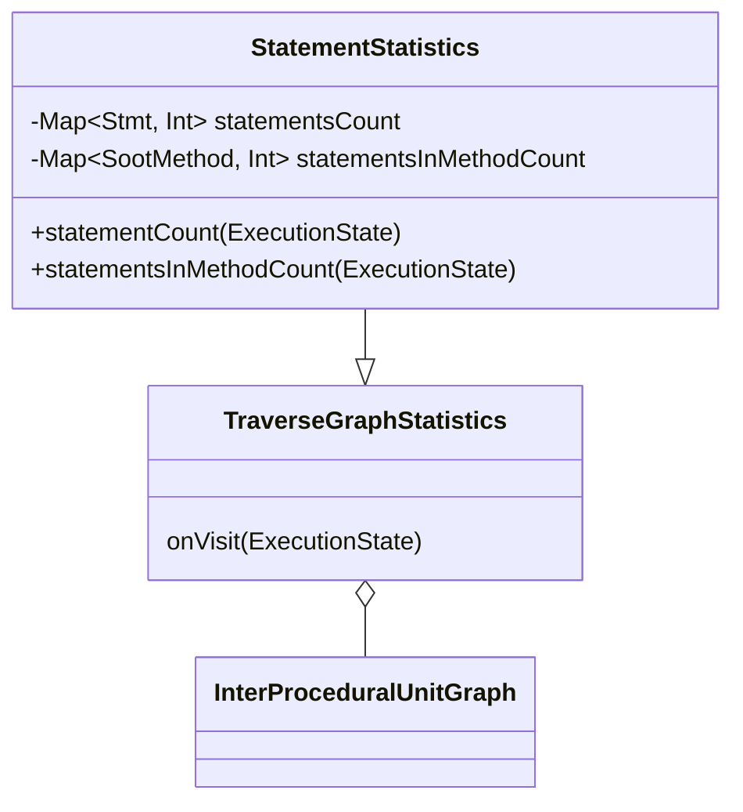
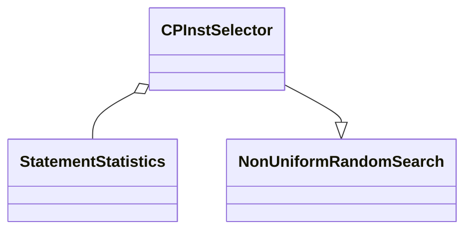
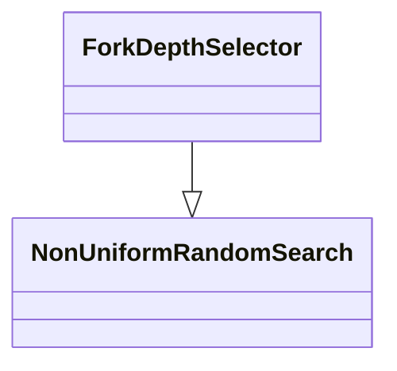

# GreedySearch

Base methods such as `offer` or `remove` is implemented pretty simple and just a delegation to `states`.

In `peekImpl` we find the set of `states` with maximum `weight` and peek random among them, so to use this class in implementation of some `pathSelector`, you just need to override an `ExecutionState.weight`.

# SubpathStatistics

`Subpath` = `List<Edge>`

This class maintains frequency of each subpath with length `2^index`, which is presented as `List<Edge>`, on certain instance of `InterproceduralUnitGraph`

* `onVisit(state: ExecutionState)` - we calculate subpath of this state and increment its frequency on `1`
* `subpathCount(state: ExecutionState)` - we calculate subpath of this state and return its frequency

# SubpathGuidedSelector

Inspired by [paper](http://pxzhang.cn/paper/concolic_testing/oopsla13-pgse.pdf).

We override `ExecutionState.weight` as `-StatementStatistics.subpathCount(this)`, so we pick `state`, which `subpath` is less traveled.

# StatementStatistics

This class maintains frequency of each `Stmt` and number of `Stmt`, that was visited in some `SootMethod`, on certain instance of `InterproceduralUnitGraph`.

* `onVisit(state: ExecutionState)` - increment frequency of state's `stmt` on 1. If we visit this `stmt` for the first time, then increment number of `Stmt`, that we visit in current state's `method`, on 1.
* `statementCount(state: ExecutionState)` - get frequency of state's `stmt`
* `statementsInMethodCount(state: ExecutionState)` - get number of `stmt`, that was visited in current state's `method`.

# CPInstSelector

Override `ExecutionState.cost` as `StatementStatistics.statementInMethodCount(this)`, so we are more likely to explore the least explored `method`.

# ForkDepthSelector

Override `ExecutionState.cost` as `ExecutionState.depth`, so we are more likely to explore the least deep `state` in terms of number of forks on its path.

