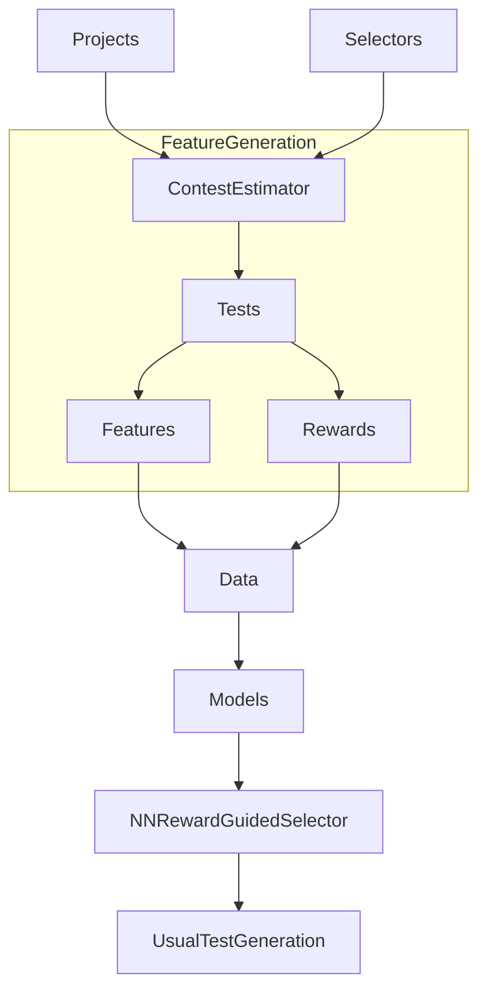

# Pipeline diagram

# Training

Briefly:

* Get dataset `D` by running `ContestEstimator` on several projects using several selectors.
* Train `model_0` using `D`
* For several `iterations` repeat (assume we on `i`-th step): 
  * Get dataset `D'` by running `ContestEstimator` on several projects using `NNRewardGuidedSelector`, which will use `model_i`
  * $$D = D \union D'$$
  * Train `model_$(i+1)` using `D`

To do this, you should:
* Be sure that you use `Java 8` by `java` command and set `JAVA_HOME` to `Java 8`. 
* Put projects, on which you want to learn in `contest_input/projects` folder, then list classes, on which you want to learn in `contest_input/classes/<project name>/list` (if it is empty, than we will take all classes from project jar).
* Run `pip install -r scripts/requirements.txt`. It is up to you to make it in virtual environment or not.
* List selectors in `scripts/selector_list` and projects in `scripts/prog_list`
* Run `./scripts/train_iteratively.sh `
