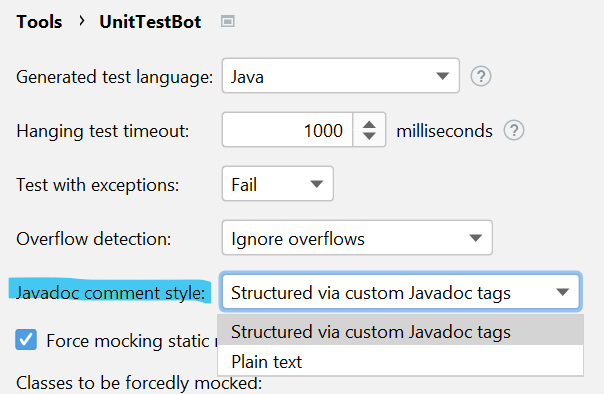
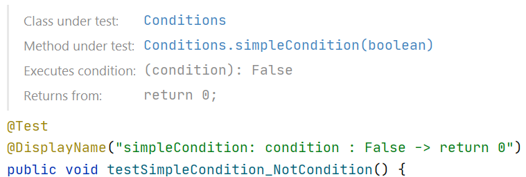

## Custom Javadoc Tags

Currently, summaries are hard to read because of formatting issues and a lot of details they contain.

**Goal**: to make test summaries structured and clear.

**Idea**: to structure summary by introducing custom JavaDoc tags.

Tags should start with a prefix "utbot" to avoid possible issues with user (or some plugin) custom tags (if they have
the same names).

**Suggested custom tags (NOT ALL OF THEM ARE USED)**

| Name                       | Description                        | Usage example                                                   |
|----------------------------|------------------------------------|-----------------------------------------------------------------|
| `@utbot.classUnderTest`    | Inline link to the enclosing class | `@utbot.methodUnderTest {@link main.IntMath}`                   |     
| `@utbot.methodUnderTest`   | Inline link to the method we test. | `@utbot.methodUnderTest {@link main.IntMath#pow(int, int)}`     |
| `@utbot.expectedResult`    | Value we expect to get.            | `@utbot.expectedResult 4`                                       |
| `@utbot.actualResult`      | Value we got.                      | `@utbot.actualResult 64`                                        |
| `@utbot.executes`          | Executed condition.                | `@utbot.executes {@code (k < Integer.SIZE): True}`              |
| `@utbot.invokes`           | Invoked method.                    | `@utbot.invokes {@link main.IntMath#mul(int, int)}`             |
| `@utbot.triggersRecursion` | Triggered recursion.               | `@utbot.recursion triggers recursion of leftBinSearch`          |
| `@utbot.activatesSwitch`   | Activated switch case.             | `@utbot.activatesSwitch {code case 10}`                         |
| `@utbot.returnsFrom`       | Statement we return from.          | `@utbot.returnsFrom {@code return (k == 0) ? 1 : 0;}`           |
| `@utbot.throwsException`   | Thrown exception.                  | `@utbot.throwsException {@link java.lang.NullPointerException}` |
| `@utbot.caughtException`   | Caught exception.                  | `@utbot.caughtException {@code RuntimeException e}`             |

## Settings

There is a setting `Javadoc comment style` in the main plugin's `Settings`. It has two options: `Plain` text
and `Structured via custom Javadoc tags` (selected by default).

## View

There are two modes the comment could be shown in IntelliJ IDEA: plain text and rendered view.

To activate rendered mode, click on the toggle near comment.

## Implementation details

Implemented `JavadocTagInfo` to introduce our custom JavaDoc tags.

Implemented `CustomJavadocTagProvider` and registered it in `plugin.xml` to support plugin's custom tags.

Overrided behavior of `JavaDocumentationProvider#generateRenderedDoc` and registered it in `plugin.xml` to render our
custom JavaDoc tags correctly.

Added a flag `USE_CUSTOM_TAGS` to settings.

After plugin's removal, IDE doesn't recognize our custom tags. It doesn't lead to errors, but highlights tags with
yellow color.

## Test scenarios

Currently, the feature works only for Symbolic execution engine, so make sure the slider is on the Symbolic execution
side.

### Default behaviour (the feature is enabled).

1. Run plugin on any Java project and run tests generation.
2. Check if the comments are generated and pretty formatted.
3. Check that all links are clickable (parts that start with `@link` tag).

### Manual settings (you can choose any comment style – old and new).

1. Go to the `Settings` menu, check that the drop-down list `Javadoc comment style` exists and has two options (Plain
   text
   and Structured via custom Javadoc tags).
2. Select any option, click OK, run tests generation and check that the option is applied and the comments are generated
   according to the chosen style.

### Content

First, generate comment with one style, then generate with another one and compare its content. If it differs,
please, provide code snippet and both generated comments. It could differ because currently the
style with custom Javadoc tags is a bit simplified.

### View

Check that the comments are rendered well. To do it, click on the toggle near the comment (see post about Rendered
view feature in IntelliJ IDEA).