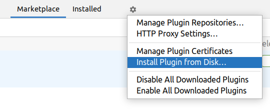

# UTBot Go

## About project

UTBot Go _**automatically generates unit tests for Go programs**_. Generated tests:

* provide _high code coverage_ and, as a result, its reliability;
* fixate the current behavior of the code as _regression tests_.

The core principles of UTBot Go are _**ease of use**_ and _**maximizing code coverage**_.

***

_The project is currently under development._

## Features

At the moment, only the _basic fuzzing technique_ is supported: namely, the execution of functions on predefined values,
depending on the type of parameter.

At the moment, functions are supported, the parameters of which have _any primitive types_, namely:

* `bool`
* `int`, `int8`, `int16`, `int32`, `int64`
* `uint`, `uint8`, `uint16`, `uint32`, `uint64`
* `byte`, `rune`, `string`
* `float64`, `float32`
* `complex128`, `complex64`
* `uintptr`

For floating point types, _correct work with infinities and NaNs_ is also supported.

Function result types are supported the same as for parameters, but with _support for types that implement `error`_.

In addition, UTBot Go correctly captures not only errors returned by functions, but also _`panic` cases_.

Examples of supported functions can be found [here](go-samples/simple/primitive_types.go).

## Important notes

### Where are tests generated?

It is true that in the described API it is currently almost impossible to customize the file in which the tests are
generated. By default, test generation results in the file `[name of source file]_go_ut_test.go` _located in the same
directory and Go package_ as the source file.

In other words, tests are generated right next to the source code. But why?

* Go was created for convenient and fast development, therefore it has appropriate guidelines: `Testing code typically
  lives in the same package as the code it tests` ([source](https://gobyexample.com/testing)). For example, this
  approach provides a clear file structure and allows you to run tests as simply and quickly as possible.
* Placing tests in the same package with the source code allows you to test private functions. Yes, this is not good
  practice in programming in general: but, again, it allows you to develop in Go faster by automatically checking even
  the internal implementation of the public API of the package via unit testing.
* This approach avoids problems with dependencies from imported packages etc. It's always nice not to have them, if
  possible.

Of course, Go has the ability to store tests away from the source code. In the future, it is planned to support this
functionality in the UTBot Go.

However, the word `almost` in the first sentence of this section is not redundant at all, there is _a small hack_. When
using the `generateGo` CLI command, you can set the generated tests output mode to StdOut (`-p, --print-test` flag).
Then using, for example, bash primitives, you can redirect the output to an arbitrary file. Such a solution will not
solve possible problems with dependencies, but will automatically save the result of the generation in the right place.

### Is there any specific structure of Go source files required?

Yes, unfortunately or fortunately, it is required. Namely, the source code file for which the tests are generated _must
be in a Go project_ consisting of a module and packages.

But do not be afraid! Go is designed for convenient and fast development, so <ins>_it's easy to start a Go
project_</ins>. For example, the [starter tutorial](https://go.dev/doc/tutorial/getting-started) of the language just
tells how to create the simplest project in Go. For larger projects, it is recommended to read a couple of sections of
the tutorial further: [Create a Go module](https://go.dev/doc/tutorial/create-module)
and [Call your code from another module](https://go.dev/doc/tutorial/call-module-code).

To put it simply and briefly, in the simplest case, it is enough to use one call to the `go mod init` command. For more
complex ones, `go mod tidy` and `go mod edit` may come in handy. Finally, when developing in IntelliJ IDEA, you almost
don’t have to think about setting up a project: it will set everything up by itself.

But <ins>_why does UTBot Go need a Go project_</ins> and not enough files in a vacuum? The answer is simple &mdash;
dependencies. Go modules are designed to conveniently support project dependencies, which are simply listed in
the `go.mod` file. Thanks to it, modern Go projects are easy to reproduce and, importantly for UTBot Go, to test.

In the future, it is planned to add the ability to accept arbitrary code as input to UTBot Go and generate the simplest
Go project automatically.

## Install and use easily

### IntelliJ IDEA plugin

<ins>_Requirements:_</ins>

* `IntelliJ IDEA (Ultimate Edition)`, compatible with version `2022.1`;
* installed `Go SDK` version later than `1.18`;
* installed in IntelliJ IDEA [Go plugin](https://plugins.jetbrains.com/plugin/9568-go), compatible with the IDE
  version (it is for this that the `Ultimate` edition of the IDE is needed);
* properly configured Go module for source code file (i.e. for file to generate tests for): corresponding `go.mod` file
  must exist;
* installed Go module `github.com/stretchr/testify/assert` to run tests: fortunately, IDEA will automatically highlight
  it and offer to install the first time the tests are generated.

Most likely, if you are already developing Go project in IntelliJ IDEA, then you have already met all the requirements.

<ins>_To install the UTBot Go plugin in IntelliJ IDEA:_</ins>

* just find the latest version of [UnitTestBot](https://plugins.jetbrains.com/plugin/19445-unittestbot) in the plugin
  market;
* or download zip archive with `utbot-intellij JAR`
  from [here](https://github.com/UnitTestBot/UTBotJava/actions/runs/3012565900) and install it in IntelliJ IDEA as
  follows from plugins section (yes, you need to select the entire downloaded zip archive, it does not need to be
  unpacked).
  

Finally, you can <ins>_start using UTBot Go_</ins>: open any `.go` file in the IDE and press `alt + u, alt + t`. After
that, a window will appear in which you can configure the test generation settings and start running it in a couple
of clicks.

See an example demo for [`primitive_types.go`](go-samples)!


### CLI application

<ins>_Requirements:_</ins>

* installed `Java SDK` version `11` or higher;
* installed `Go SDK` version later than `1.18`;
* properly configured Go module for source code file (i.e. for file to generate tests for): corresponding `go.mod` file
  must exist;
* installed `gcc` and Go module `github.com/stretchr/testify/assert` to run tests.

<ins>_To install the UTBot Go CLI application:_</ins> download zip archive containing `utbot-cli JAR`
from [here](https://github.com/UnitTestBot/UTBotJava/actions/runs/3012565900), then extract its content (JAR file) to a
convenient location.

Finally, you can <ins>_start using UTBot Go_</ins> by running the extracted JAR on the command line. Two actions are
currently supported: `generateGo` and `runGo` for generating and running tests, respectively.

For example, to find out about all options for actions, run the commands as follows
(`utbot-cli-2022.8-beta.jar` here is the path to the extracted JAR):

```bash
java -jar utbot-cli-2022.8-beta.jar generateGo --help
```

or

```bash
java -jar utbot-cli-2022.8-beta.jar runGo --help
```

respectively.

<ins>_Action `generateGo` options:_</ins>

* `-s, --source TEXT`, _required_: specifies Go source file to generate tests for.
* `-f, --function TEXT`: specifies function name to generate tests for. Can be used multiple times to select multiple
  functions at the same time. If no functions are specified, all functions contained in the source file are selected.
* `-go, --go-path TEXT`, _required_: specifies path to Go executable. For example, it could be `/usr/local/go/bin/go`
  for some systems.
* `-t, --each-execution-timeout INT`: specifies a timeout in milliseconds for each fuzzed function execution. Default is
  `1000` ms.
* `-p, --print-test`: specifies whether a test should be printed out to StdOut. Is disabled by default.
* `-w, --overwrite`: specifies whether to overwrite the output test file if it already exists. Is disabled by default.
* `-h, --help`: show help message and exit.

<ins>_Action `runGo` options:_</ins>

* `-p, --package TEXT`, _required_: specifies Go package to run tests for.
* `-go, --go-path TEXT`, _required_: specifies path to Go executable. For example, it could be `/usr/local/go/bin/go`
  for some systems.
* `-v, --verbose`: specifies whether an output should be verbose. Is disabled by default.
* `-j, --json`: specifies whether an output should be in JSON format. Is disabled by default.
* `-o, --output TEXT`: specifies output file for tests run report. Prints to StdOut by default.
* `-cov-mode, --coverage-mode [html|func|json]`: specifies whether a test coverage report should be generated and
  defines its mode. Coverage report generation is disabled by default. Examples of different coverage reports modes can
  be found [here](go-samples/simple/reports).
* `-cov-out, --coverage-output TEXT`: specifies output file for test coverage report. Required if `[--coverage-mode]` is
  set.

## Contribute to UTBot Go

If you want to _take part in the development_ of the project or _learn more_ about how it works, check
out [DEVELOPERS_GUIDE.md](docs/DEVELOPERS_GUIDE.md).

For the current list of tasks, check out [FUTURE_PLANS.md](docs/FUTURE_PLANS.md).

Your help and interest is greatly appreciated!
