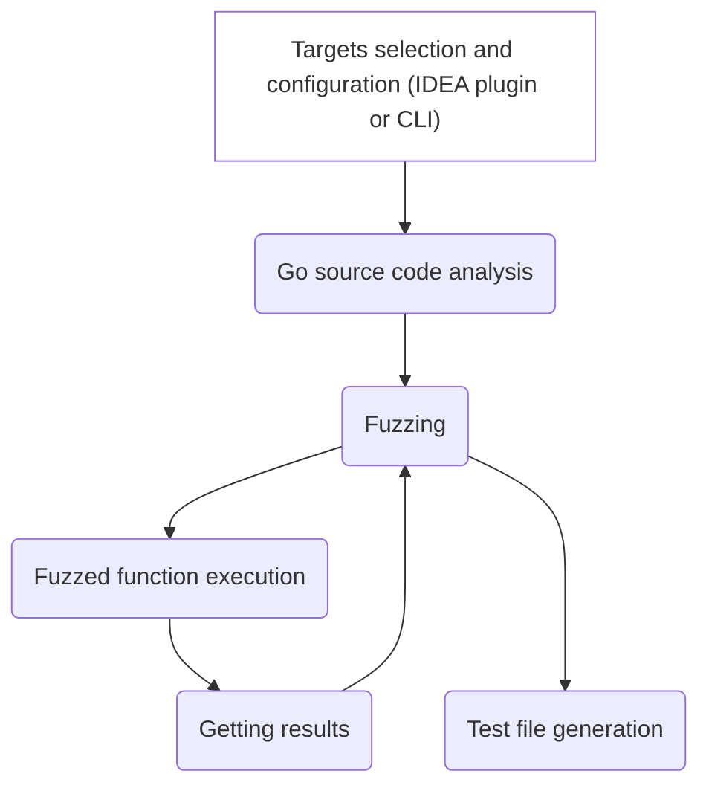

# UTBot Go: Developers Guide

# How UTBot Go works in general

In the diagram above, you can see _the main stages of the UTBot Go test generation pipeline_. Let's take a look at each
in more detail!

### Targets selection and configuration

This block in the diagram is highlighted in a separate color, since the action is mainly performed by the user. Namely,
the user selects the target source file and functions for which tests will be generated and configure generation
parameters (for example, fuzzed function execution timeout, path to Go executable, etc.).

If UTBot Go is built as a plugin for IntelliJ IDEA, then the user opens the target Go source file and, using a keyboard
shortcut, calls up a dialog window where it's possible to select functions and configure settings.

If UTBot Go is build as a CLI application, then the user sets the functions and parameters using command line flags.

### Go source code analysis

Once the user has chosen the target functions, it is necessary to collect information about them. Namely: their
signatures and information about types (in the basic version); constants in the body of functions and more (in the
future). This is exactly what happens at the stage of code analysis. As a result, UTBot Go gets an internal
representation of the target functions, sufficient for the subsequent generation of tests.

### Fuzzing

Fuzzing is the first part of the test cases generation process. At this stage, values, that will be used
to test the target functions, are generated. Namely, to be passed to functions as arguments in the next steps. 
Then the result of function execution is analyzed and the generation of new values continues or stops.

### Fuzzed function execution

In the previous step, UTBot Go generated the values that the functions need to be tested with &mdash; now the task is to
do this. Namely, execute the functions with the values generated for them.

Essentially, the target function, the values generated for it, and the result of its execution form a test case. In
fact, that is why this stage ends the global process of generating test cases.

### Getting results

Saving results of fuzzed function execution and sending them to fuzzing for analysis.

### Test code generation

Finally, the last stage: the test cases are ready, UTBot Go needs only to generate code for them. Need to carefully consider the features of the Go language (for example, the necessity to cast
constants to the desired type).

_That's how the world (UTBot Go) works!_

## How to test UTBot Go

_**TODO:**_ Gradle `runIde` task or building CLI application JAR locally. To build CLI version the `build` on `utbot-cli-go` should be called.

