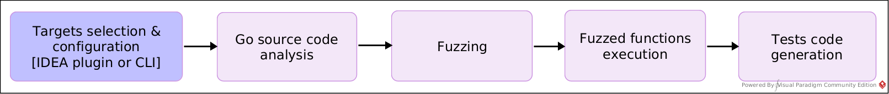
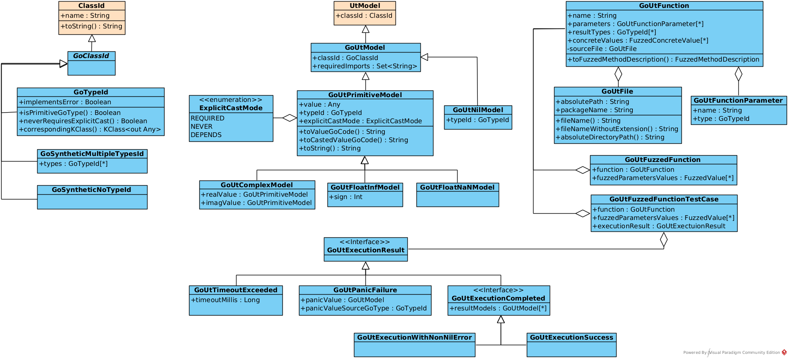

# UTBot Go: Developers Guide

# How UTBot Go works in general

In the diagram above, you can see _the main stages of the UTBot Go test generation pipeline_. Let's take a look at each
in more detail!

### Targets selection and configuration

This block in the diagram is highlighted in a separate color, since the action is mainly performed by the user. Namely,
the user selects the target source file and functions for which tests will be generated and configure generation
parameters (for example, fuzzed function execution timeout, path to Go executable, etc.).

If UTBot Go is built as a plugin for IntelliJ IDEA, then the user opens the target Go source file and, using a keyboard
shortcut, calls up a dialog window where it's possible to select functions and configure settings.

If UTBot Go is build as a CLI application, then the user sets the functions and parameters using command line flags.

### Go source code analysis

Once the user has chosen the target functions, it is necessary to collect information about them. Namely: their
signatures and information about types (in the basic version); constants in the body of functions and more (in the
future). This is exactly what happens at the stage of code analysis. As a result, UTBot Go gets an internal
representation of the target functions, sufficient for the subsequent generation of tests.

### Fuzzing

Fuzzing is the first part of the test cases generation process. At this stage, values, that will be used
to test the target functions, are generated. Namely, to be passed to functions as arguments in the next steps.

For now, the most basic fuzzing technique is used: for each type a list of predefined corner-case values is generated.
For example, for `int` type: `0`, `1`, `-1`, `math.MinInt`, and `math.MaxInt`. In the future, values generation can be
improved by using constants from the body of the target functions and some randomizing.

### Fuzzed functions execution

In the previous step, UTBot Go generated the values that the functions need to be tested with &mdash; now the task is to
do this. Namely, execute the functions with the values generated for them and save the result.

Essentially, the target function, the values generated for it, and the result of its execution form a test case. In
fact, that is why this stage ends the global process of generating test cases.

### Test code generation

Finally, the last stage: the test cases are ready, UTBot Go needs only to generate code for them. Nothing terrible
happens here, but one need to carefully consider the features of the Go language (for example, the necessity to cast
constants to the desired type, oh).

_That's how the world (UTBot Go) works!_

# Deep dive: project's codebase and architecture decisions

## Api

Api classes are responsible for Go's internal representation of types, value models, functions, and their results. These
classes are used throughout the UTBot Go logic.

The vast majority of classes are in the corresponding [`api` package](../src/main/kotlin/org/utbot/go/api). However, the
`GoClassId` and `GoUtModel` classes can be found in the common for
UTBot `utbot-framework-api` module,
in [`GoApi.kt`](../../utbot-framework-api/src/main/kotlin/org/utbot/framework/plugin/api/go/GoApi.kt) file for
compatibility reasons. Also, to ensure compatibility, Api classes are used in many `when`-s of the original UTBot code:
however, there is no logic there, only errors are thrown.

The following sections will describe the Api classes in detail. However, Api also has util functions separately
collected in [util package](../src/main/kotlin/org/utbot/go/api/util). It is useful to study them if you need to work
with Api classes a lot and deeply (so you can reuse some of utils).

### Types representation

In the original UTBot, the base class of the type system is `ClassId`. Accordingly, `GoClassId` is used for
compatibility
with it. Also, the `GoSyntheticMultipleTypesId` and `GoSyntheticNoTypeId` classes are needed solely to convert
inexpressible (in terms of regular UTBot types) Go types to `GoClassId`: multiple results returned from a function and
no
return value, respectively. The only real class for all Go types is the `GoTypeId` class, which describes any Go types
in
the project. So far, this is where the type hierarchy ends, but `GoTypeId` may have descendants in the future.

`GoTypeId` class. At the moment, the type is identified by its name, which can be found in the source Go code. All other
fields / methods are currently needed for code generation:

* `ImplementsError` allows you to separate successful runs and those that ended with an error;
* `IsPrimitiveGoType(): Boolean` is useful for generating panic tests (if the type of panic value is primitive, then it
  can be checked, otherwise not yet);
* `neverRequiresExplicitCast(): Boolean` is self-explanatory;
* `correspondingKClass(): KClass<out Any>` allows you, if possible, to convert a value of a Go-defined type to a Kotlin
  value, rather than storing it as a string: for now, this is just done, but in the future it may be useful.

By the way, most of the methods are written as extensions in the utility files.

### Value models representation

Similar to the type hierarchy, at the source is the base class of the original UTBot's model hierarchy &mdash;
`UtModel`. Accordingly, its successor, which defines all models for Go, is the `GoUtModel` class. The `classId` field
just refers to `UtModel`, but uses the `GoClassId` specification (not `GoTypeId` &mdash; for compatibility);
the `requiredImports`field is needed for code generation (some values, for example, such as `math.MaxInt`, require
certain packages).

The successors of `GoUtModel` are already classes that in one way or another set and store the described value. For
example, the `GoUtPrimitiveModel` class describes a primitive type value model, so it directly stores it (`value: Any`
field). The `GoUtNilModel` class, on the other hand, defines the model for the `nil` value in the Go language:
obviously, no explicit value needs to be stored in it. In the future, the list of `GoUtModel` descendants will have to
be supplemented by classes that describe the value models of structures built into Go (arrays, slices, maps, ...),
custom classes, etc.

Learn more about the `GoUtPrimitiveModel` class. Above, only one of its fields was not mentioned
&mdash; `explicitCastMode`, which is necessary exclusively for code generation. For example, values of complex types
never need an explicit cast, as they are generated with an explicit `complex64` / `complex128` constructor. Values of
type `float32`, on the contrary, are almost always needed, since otherwise they will be converted to `float64` by
default (respectively, `REQUIRED` will be set to the model at some point). And so on.

The `toValueGoCode(): String` and `toCastedValueGoCode(): String` methods allow you to set the display of the value in
code generation &mdash; they are automatically used in the appropriate way in `toString(): String`.

Finally, `GoUtPrimitiveModel` has several descendants, which in turn define models with even more specific values of
primitive types. `GoUtComplexModel` specifies the value models of complex types (`complex64` and `complex128` in Go),
respectively: they need to store two floating point values, for the real and imaginary parts. `GoUtFloatInfModel` and
`GoUtFloatNaNModel` in turn define special values for floating point types: infinity and `NaN`. They cannot be expressed
correctly as a number in the form of `GoUtPrimitveModel`, so special classes solve this problem.

### Functions representation

The most important data classes of the entire API are `GoUtFunction`, which define the internal representation of the
tested functions. UTBot Go receives the input functions just by their names and paths to the source Go file; and then
`GoSourceCodeAnalyzer` extracts information about them from the source code exactly in the form of `GoUtFunction`-s. In
fact, `GoUtFunction` contains all the information necessary for generating tests: signature (`name`, `parameters`,
`resultTypes`), information about the source file (`sourceFile`), constants from its body (`concreteValues`). Of course,
this list of fields may be expanded in the future: for example, by the receiver field to support Go methods.

`GoUtFunctionParameter` and `GoUtFile` are only auxiliary data classes for better organization of stored information.
What is unusual is that the `sourceFile` field in `GoUtFunction` is private, but this is done intentionally. As will be
discussed later (in the Core section), functions to be tested are passed inside UTBot Go as a map keyed by their source
files (`GoUtFile`-s): this makes possible to potentially optimize test generation. At the same time, it would be useful
to leave information about the source file inside `GoUtFunction` &mdash; at least for the sake of uniqueness; otherwise,
two identically named functions from different Go packages may be unexpectedly lost while moving them between map and
set structures. However, in order not to create ambiguities, the information about the file has been made private inside
`GoUtFunction`: the right way to access it is to use the key of the map in which this function was passed.

Finally, `GoUtFuzzedFunction` and `GoUtFuzzedFunctionTestCase` are just convenient data classes for expressing the
appropriate objects within UTBot Go: if it is a fuzzed function or a fuzzed function bundled with a result of
its execution, respectively.

### Execution results representation

To represent the results of fuzzed functions execution, the `GoUtExecutionResult` class hierarchy is used. Such objects
are created in a predictable way: `GoFuzzedFunctionsExecutor` gets `GoUtFuzzedFunctions`, then it executes them and
returns information about the results exactly in the form of `GoUtExecutionResult`-s.

`GoUtExecutionResult`-s exist in a form of a class hierarchy: it allows developers to better differentiate the types of
results; that can be convenient in code generation (for example, to divide tests in different test suites).
`GoUtExecutionResult` has three children: `GoUtExecutionCompleted` for functions that return results, `GoUtPanicFailure`
for functions that panic (in Go this is similar to throwing unchecked exceptions in Java) and `GoUtTimeoutExceeded` for
cases where the execution of the functions was too long and was interrupted by a timeout. The listed classes contain the
corresponding fields: result models, a description of the panic value (in Go, a `panic` is called with some argument,
for example, `panic("error description")`), a timeout value, respectively.

At the same time, `GoUtExecutionCompleted`, like `GoUtExecutionResult`, is an interface since they are not final in the
hierarchy. `GoUtExecutionCompleted` has two implementations that differ only logically: `GoUtExecutionSuccess` and
`GoUtExecutionWithNonNilError`, both are self-explanatory. However, this needs to be explained: in Go, checked
errors are passed as return values of functions, so it is a common agreement to return `nil` on success and a non-nil
error object otherwise. That is why the execution of a function with non-nil errors in the results is represented by a
separate class (`GoUtExecutionWithNonNilError`), while the remaining cases are considered
successful (`GoUtExecutionSuccess`).

Of course, in the future, if necessary, the hierarchy can be easily expanded (for example, by describing the memory
overflow case).

_That's how the world (Api classes of UTBot Go) is designed!_

## How to test UTBot Go

_**TODO:**_ Gradle `runIde` task and building CLI application JAR locally.
