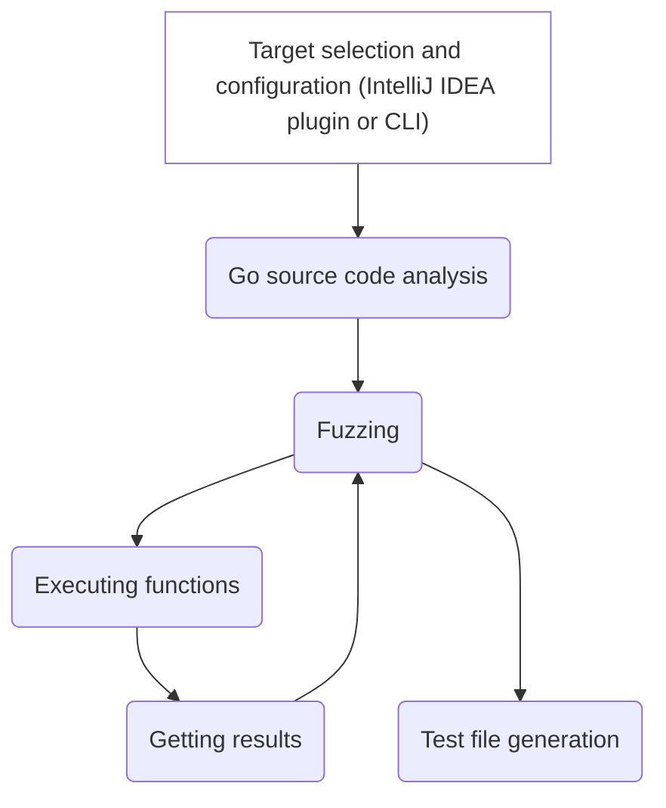

# UnitTestBot Go Developer Guide

## Overview

Here are the main stages of UnitTestBot Go test generation pipeline.

### Target selection and configuration

A user manually selects the target source file and functions to generate the tests for.
Test generation settings are also configured manually.

### Go source code analysis

UnitTestBot Go collects information about the target functions:
* signatures and type information (in the basic version);
* constants in the function bodies (to be implemented).

As a result, UnitTestBot Go gets an internal
representation of the target functions.

### Fuzzing

During the fuzzing stage, UnitTestBot Go generates the input values for the source code.

### Executing target functions

UnitTestBot Go executes the target functions with the generated values as arguments and analyses the result
to continue or stop the generation process.

### Getting results

The result of target function execution is sent to the fuzzer for analysis:
coverage rate information guides the following value generation process.
Based on this feedback,
the fuzzer decides whether it should continue or stop generating input values.

### Test code generation

Generating test source code requires support for Go language features (for example, the necessity to cast
constants to the desired type).
Extended support for various Go constructs is a future plan for us. 

## How to test UnitTestBot Go

_**TODO**_
